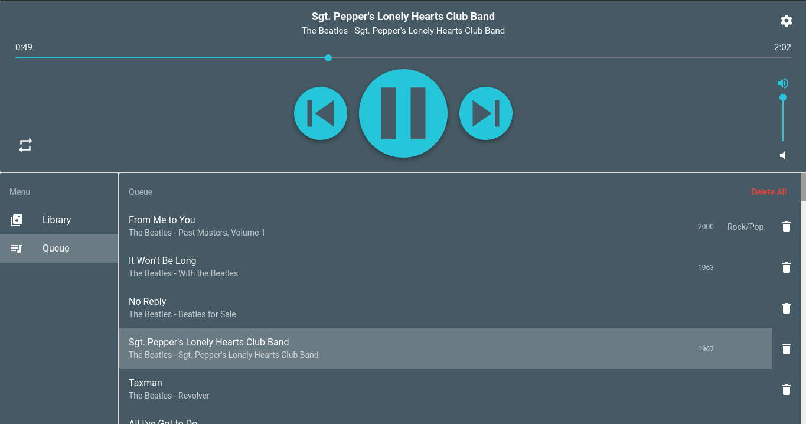

# Player 1 - Music Player

<div align="center" style="text-align: center">
  <p></p>
  <p></p>
</div>

A music player built with [Electron](http://electron.atom.io/), [React](https://facebook.github.io/react/) and [Redux](https://github.com/reactjs/redux).

## Screenshot

<div style="text-align: center">
  
</div>

## Install

* **Note: requires a node version >= 6 and an npm version >= 3.**

First, clone the repo via git:

```bash
git clone https://github.com/sachinb94/player1.git
```

And then install dependencies.

```bash
$ cd player1 && npm install
```

## Run

Run the command to start development server

```bash
$ npm run dev
```

## Packaging

To package apps for the local platform:

```bash
$ npm run package
```

To package apps for all platforms:

First, refer to [Multi Platform Build](https://github.com/electron-userland/electron-builder/wiki/Multi-Platform-Build) for dependencies.

Then,
```bash
$ npm run package-all
```

To package apps with options:

```bash
$ npm run package -- --[option]
```

## Further commands

To run the application without packaging run

```bash
$ npm run build
$ npm start
```

## License
MIT © [Sachin Bansal](https://github.com/sachinb94)
